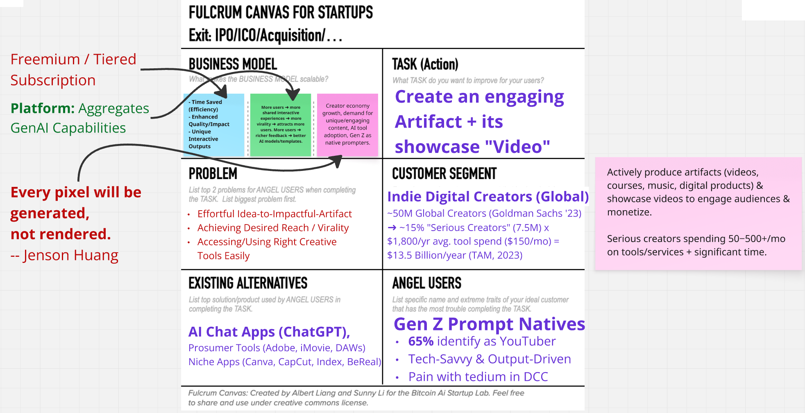
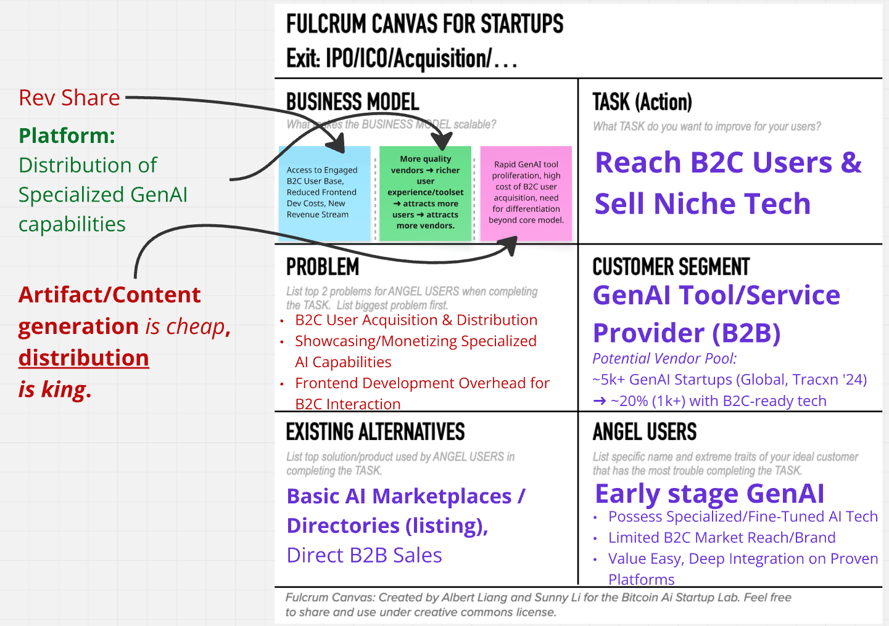
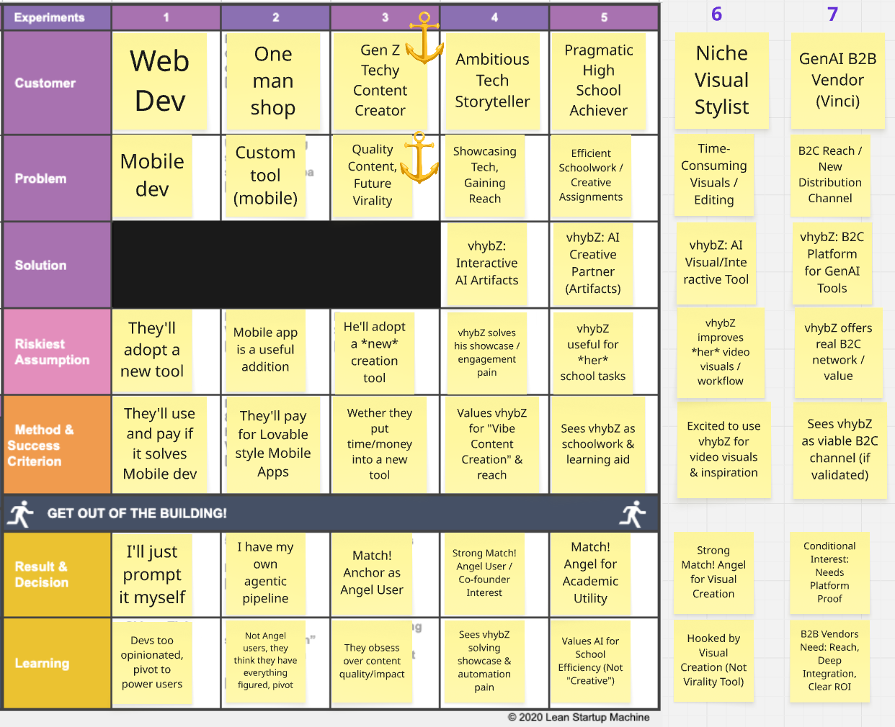

# vhybZ - User Studies & Discovery Synthesis

## Project Overview

This repository documents the user research and discovery phase for Project vhybZ. Our primary objective was to gain a deep understanding of the challenges, needs, and aspirations of various digital creators and B2B GenAI service providers. Through a series of in-depth user interviews, we iteratively refined our understanding of the core problems vhybZ aims to solve and the potential business models to pursue.

The insights gathered have directly informed our product vision for vhybZ as an AI-powered platform designed to revolutionize the creation and distribution of interactive digital artifacts. This README summarizes our key findings, validated Angel User personas, and the strategic direction derived from this discovery process.

For a detailed history of the interviews, individual transcripts, and the evolution of our hypotheses, please see the [discovery-interviews/](discovery-interviews/) directory.

## Core Problem Space Validated

Our research consistently highlighted several critical pain points and unmet needs among digital creators and specialized GenAI tool providers:

### Key Problems for User/Creators:
*   **Effortful Idea-to-Impactful-Artifact:** The journey from a creative concept to a polished, impactful digital artifact (especially video and interactive content) is often overwhelmingly tedious, time-consuming, and perceived as uncreative grunt work, particularly in areas like video editing and asset preparation.
*   **Achieving Desired Reach & Virality:** Creators invest significant effort and desire greater impact and reach for their content, but often struggle to make their work stand out and achieve viral engagement.
*   **Accessing/Using Right Creative Tools Easily:** The current landscape of creative tools can be fragmented, expensive, or complex. Creators (especially Gen Z "Prompt Natives") are adept with AI but find current generative AI tools can be context-limited or produce subpar results for nuanced creative tasks without significant prompting effort.

### Key Problems for GenAI B2B Vendors:
*   **B2C User Acquisition & Distribution:** Specialized GenAI tool providers often focus on B2B but struggle with the high cost and complexity of reaching a broad B2C audience and effectively distributing their niche technologies.
*   **Showcasing & Monetizing Specialized AI Capabilities:** Basic marketplaces often only allow for listings. Vendors need platforms that enable deep integration to truly showcase the unique value of their fine-tuned models and specialized workflows to consumers.
*   **Frontend Development Overhead for B2C Interaction:** Building and maintaining user-friendly B2C frontends for their specialized AI tech is a significant development overhead that many vendors would prefer to offload.

*(A detailed breakdown of all identified pains, needs, and wants can be found in the [discovery-interviews/README.md](discovery-interviews/README.md#consolidated-problems-needs--aspirations)).*

## vhybZ Strategic Direction: A Two-Sided Platform

Based on our findings, vhybZ is envisioned as a two-sided platform:

1.  **For User/Creators:** An AI-powered creative suite focused on making it dramatically easier and faster to produce unique, high-quality, interactive digital artifacts and their corresponding showcase videos.
2.  **For GenAI Vendors:** A distribution platform offering B2C reach and simplified integration for specialized GenAI tool providers, operating on a revenue-sharing model.

The core thesis is that "Artifact/Content generation is becoming commoditized (cheap); effective **distribution and engagement are king**." vhybZ aims to empower individual creators with superior creation tools while providing GenAI vendors with a vital channel to an engaged user base. Our technical vision is anchored in AI-native generation: "Every pixel will be generated, not rendered."

### Final Fulcrum Canvas: User/Creator Side

This canvas outlines the value proposition for our primary end-users.

*(See [discovery-interviews/README.md](discovery-interviews/README.md#canvas-31-vhybz-usercreator---final-version) for detailed breakdown)*

### Final Fulcrum Canvas: Vendor Side

This canvas outlines the value proposition for GenAI B2B companies partnering with vhybZ.

*(See [discovery-interviews/README.md](discovery-interviews/README.md#canvas-32-vhybz-vendor---final-version) for detailed breakdown)*

## Validated Angel Users & Experimentation Journey

Our iterative experimentation, documented on the Experiment Board, led us from broad initial hypotheses to highly specific and validated Angel User personas for both sides of the platform.

*(See [discovery-interviews/README.md](discovery-interviews/README.md#experiment-board-journey--key-learnings) for detailed experiment summaries)*

**Key Validated Angel User Personas (User/Creator Side):**

*   **The Ambitious Tech Storyteller (e.g., Julien):** Driven to showcase complex technical projects in engaging, interactive ways; values automation and tools that enhance clarity and reach.
*   **The Niche Visual Stylist (e.g., Termeh):** Focused on creating high-quality, aesthetically unique visual content (especially for video); hooked by tools that simplify visual creation and inspiration.
*   **The Aspiring Pro Creator (e.g., Mani):** Technically skilled, obsesses over content quality and impact for portfolio and future professionalization; pained by tedious production workflows.
*   **The Pragmatic Student Achiever (e.g., Hastia):** Values AI tools primarily for academic efficiency and completing creative assignments effectively.

**Key Validated Angel User Profile (Vendor Side):**

*   **Early-Stage/Innovative GenAI B2B Provider (e.g., Sid/Vinci):** Possesses specialized AI tech but has limited B2C reach; values platforms offering deep integration, access to an engaged user base, and clear ROI, contingent on platform proof.

## Conclusion & Next Steps

The discovery phase has validated significant market pain and strong interest in a solution like vhybZ from distinct Angel User segments on both the creator and potential vendor sides. The refined Fulcrum Canvases and Experiment Board learnings provide a clear strategic direction.

The immediate focus is to develop a Minimum Viable Product (MVP) for the **User/Creator side**, targeting the "Effortful Idea-to-Impactful-Artifact" problem for our validated Angel User personas. Key features will revolve around AI-assisted generation of unique, interactive visual artifacts and their streamlined showcasing. Continuous user feedback and iterative development will be paramount.
